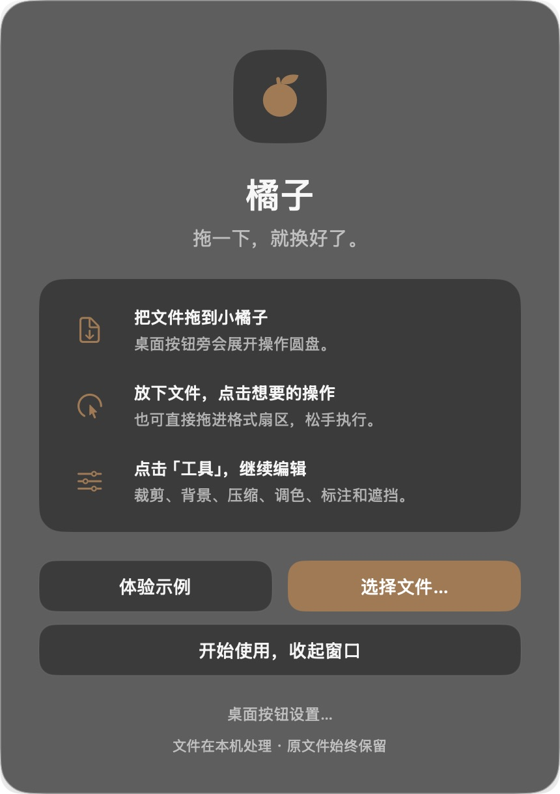

# 橘子 / Citrus for Mac

[中文](README.md) · [English](README.en.md) · [中文图文教程](docs/GUIDE.zh-CN.md) · [English guide](docs/GUIDE.en.md)

在 Mac 本机转换文件、裁剪图片、添加背景。橘子常驻菜单栏，把常用操作放进一个圆形菜单。

[](docs/media/citrus-demo-horizontal-zh-en.mp4)

**[▶ 查看完整 28 秒高清演示，含轻音效与中英字幕](docs/media/citrus-demo-horizontal-zh-en.mp4)** · [竖屏版本](docs/media/citrus-demo-vertical-zh-en.mp4) · [封面与可编辑素材](docs/MEDIA.md)

演示使用橘子 1.0.1 的实际界面和实际导出文件；光标动效重演，流程从“选择文件…”进入。画面只包含专门制作的演示文件。

**MIT 开源界面预览 1.1.0。** 此分支包含桌面小橘子、可直接点击的格式／工具切换和原生玻璃界面。安装后的本地程序记录为 **108 PASS / 0 FAIL / 0 SKIP**，其中新增16项；[全部用例与界面截图](docs/UI_REVIEW_1_1.md)。真实 Finder 拖入、按钮移动和桌面层级体验仍待验收。本页下方的视频和旧图文教程展示的是 **1.0.1**；[主分支](https://github.com/skynet518/citrus-mac/tree/main)保留该版本。此分支是开源预览，未宣称完整产品验收通过。



## 先体验：PDF → JPG → 裁剪 → 背景

1. 启动“应用程序”中的 `橘子.app`，点击使用说明里的 **选择文件…**，或点击菜单栏的白色橘子图标进入同一入口。
2. 选择 [Citrus Demo.pdf](docs/demo-files/Citrus%20Demo.pdf)，点击圆盘上的 **JPG**。结果保存在原文件旁边。
3. 再选择生成的 JPG，点击圆盘中心的 **工具**（或按 **Tab**），点击 **Crop**。拖动裁剪手柄，点击 **Apply**。
4. 选择裁剪后的副本，点击 **工具**（或按 **Tab**），点击 **Add BG**。调整背景、留白、圆角、阴影与比例，点击 **Save with Background**。

每一步的实际截图、按钮说明和输出示例都在 **[中文图文教程](docs/GUIDE.zh-CN.md)**。原文件保留；输出重名时自动添加序号。`Esc` 关闭圆盘，方向键与回车也可选择操作。

## 安装与构建

仓库当前提供源码和已验证的构建流程。构建1.1.0需要包含macOS26 SDK的Xcode或Apple Command Line Tools，以及Swift 6工具链。

```sh
./scripts/build-app.sh
./scripts/test.sh
```

将生成的 `dist/橘子.app` 放入“应用程序”，双击启动。应用运行后常驻顶部菜单栏，主窗口收起后可从白色橘子图标打开“使用方法”或“选择文件…”。当前应用包使用临时签名，尚未完成 Apple Developer ID 签名和公证。

最低系统声明是 macOS 14；本地实际验证为 Apple Silicon、macOS 26.5.1、Swift 6.3.3，GitHub 检查为 macOS 26 ARM64。Intel 和其他 macOS 版本尚未完成真机验收。Windows 和 Linux 适配已延期。

音视频处理需要在本机另行安装 FFmpeg；应用不下载、不捆绑它。程序查找 `/opt/homebrew/bin/ffmpeg` 或 `/usr/local/bin/ffmpeg`。首次构建会通过 Swift Package Manager 下载固定版本的 Swift-WebP 及其依赖。

## 功能与边界

| 范围 | 已实现内容 | 使用边界 |
| --- | --- | --- |
| 图片转换 | JPG、PNG、WebP、HEIC、TIFF、AVIF、BMP、PDF、DOCX | 输出编码已在所列自动用例中核验；所有输入输出组合尚未全部验收 |
| 图片工具 | 压缩、元数据、调色、标注、背景、裁剪、遮挡 | PNG 压缩会减少颜色；GIF 编辑使用首帧 |
| PDF | 按页转图片、拆分、合并、文字提取与系统 OCR | 压缩会栅格化，不保留可搜索文字；PDF 转 DOCX 不保证复杂版式 |
| 文档与媒体 | 图片嵌入 DOCX、字幕转换、归档操作、本机 FFmpeg 音视频处理 | Word/Pages 实际渲染、全部媒体编辑组合待验收；RAR 创建不在当前范围 |

新版入口设计是把文件拖到桌面小橘子，在旁边展开圆盘，放下后点击操作；右键或欢迎页设置可选择“浮在窗口上方／仅在桌面”。此流程仍待真实鼠标验收。[待确认步骤](docs/UI_REVIEW_1_1.md#定稿前待确认)。旧版Shift拖拽默认关闭，可在菜单栏开启兼容选项。

## 测试与证据

- [当前1.1.0全部108项结果、界面检查和待验收项](docs/UI_REVIEW_1_1.md)
- [1.0.1历史92项测试](docs/TESTING.md)
- [1.0.1历史GitHub Actions成功运行 #37063085729](https://github.com/skynet518/citrus-mac/actions/runs/37063085729)
- [本地逐项回执](docs/evidence/local-verification.json) · [独立构建摘要](docs/evidence/clean-build-summary.json) · [云端逐项回执](docs/evidence/github-ci-verification.json)
- [演示素材检查报告](docs/MEDIA_VALIDATION.md)：版面、字幕对比度、完整解码、素材来源与隐私检查

自动功能结果、演示素材检查、真实桌面验收分别记录。旧版演示资料保留；新版界面源代码和安装版本证据见上方1.1.0报告。

## 本地数据与许可证

文件处理代码不包含上传文件或调用在线模型的操作。应用自己的示例保存在用户的 `Application Support/CitrusLocal`；诊断日志位于 `Library/Logs/CitrusLocal/events.jsonl`，输出事件可能含本地文件路径，日志不自动上报。

橘子是独立实现，交互参考使用者提供的 Tangerine 演示，与 Tangerine 无隶属关系，也未复制其源码、商标或界面素材。当前版本没有宣称复现原产品的全部功能或全部状态。

本项目原创代码和素材使用 [MIT](LICENSE)。第三方组件及演示动画库保留各自许可，见 [第三方声明](THIRD_PARTY_NOTICES.md)。
