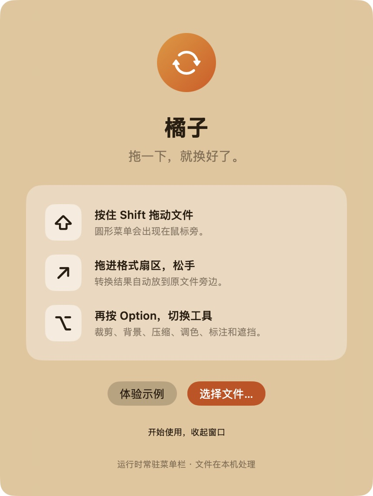
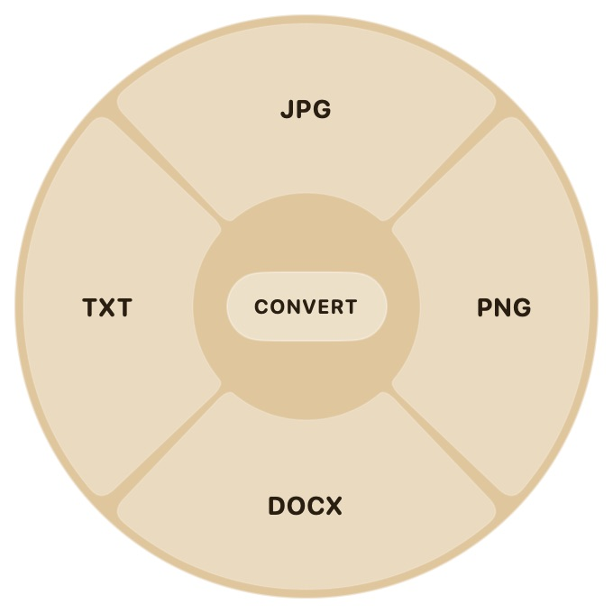
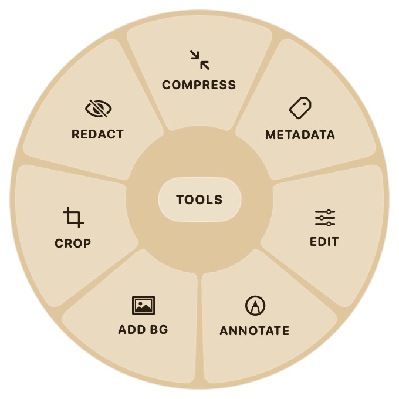
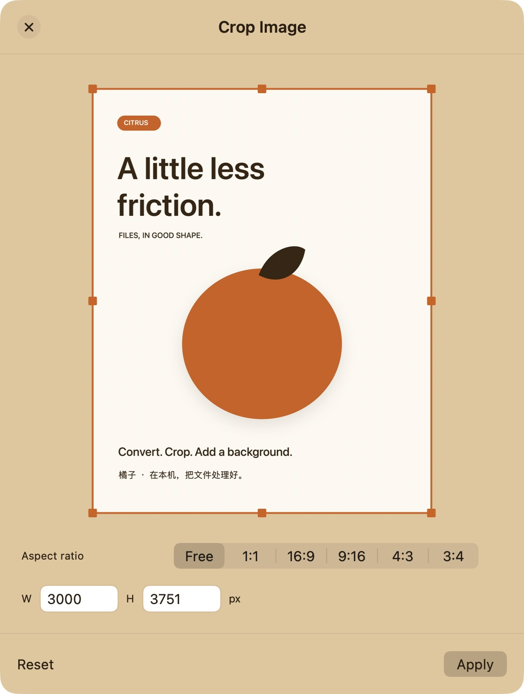
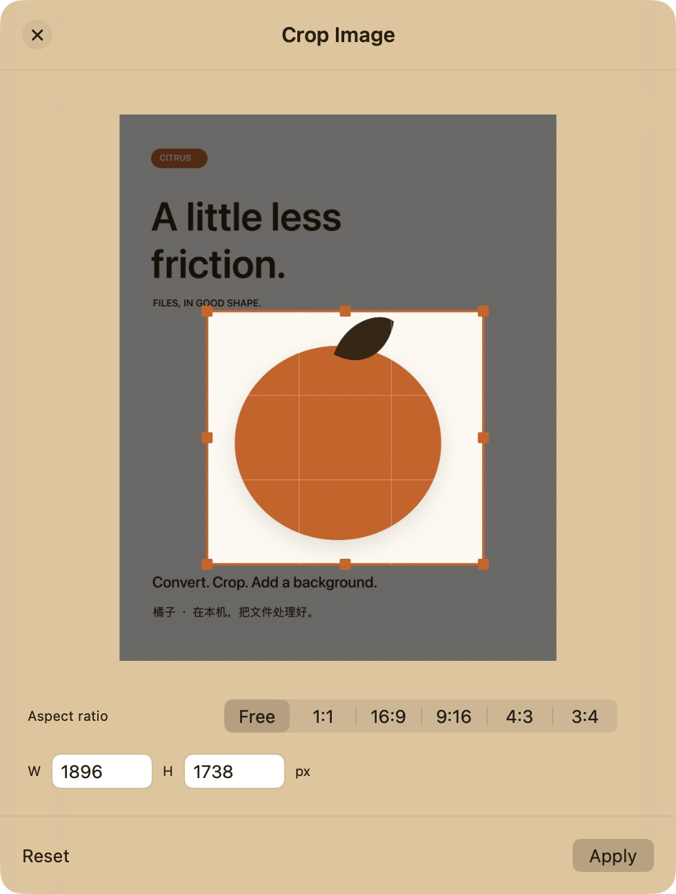
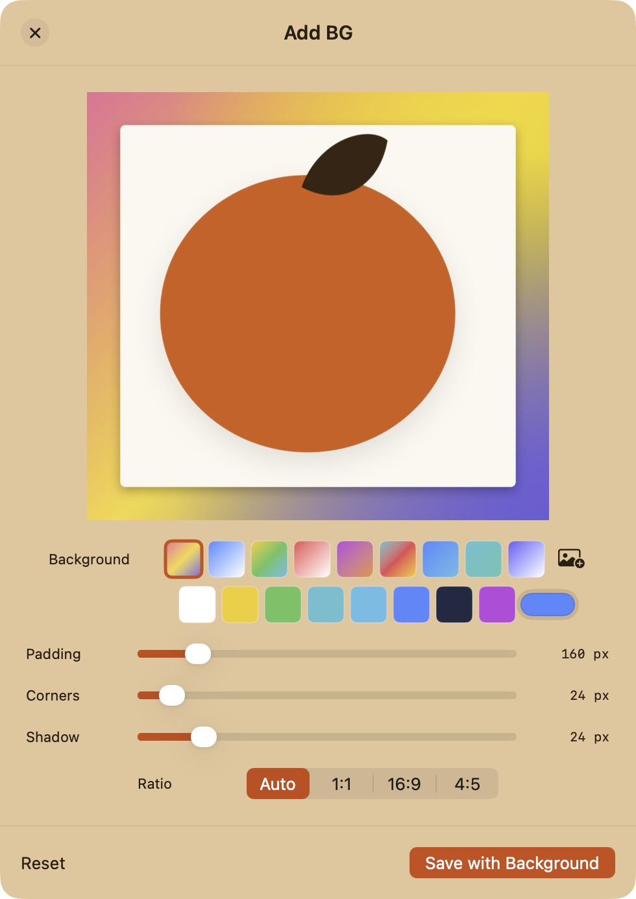
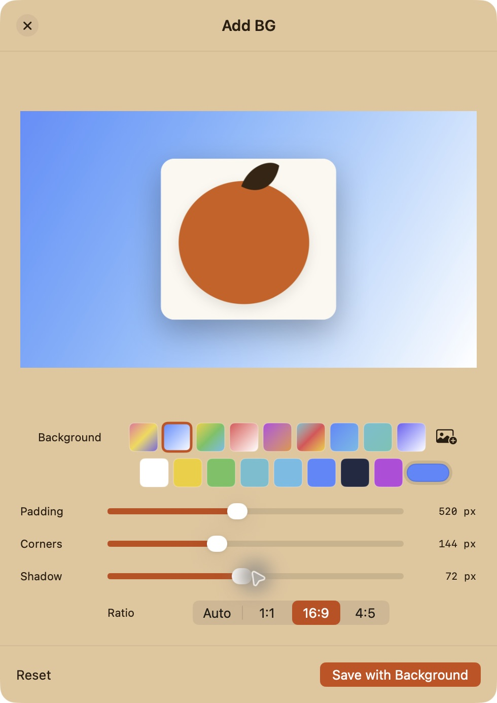

# 橘子：五步完成一张演示图片

[返回首页](../README.md) · [English](GUIDE.en.md) · [观看 28 秒演示](media/citrus-demo-horizontal-zh-en.mp4)

本教程使用橘子 1.0.1 的实际界面，流程是“选择文件 → 圆盘点击 → 保存副本”。所有截图都只显示应用窗口；示例文件由本项目专门制作。真实 Finder Shift / Shift+Option 入口仍在复验中，状态见 [验收清单](ACCEPTANCE.md)。

## 1. 启动并选中演示 PDF

将构建生成的 `橘子.app` 放进“应用程序”，双击打开。点击欢迎窗口的 **选择文件…**；窗口收起后，可点击顶部菜单栏的白色橘子图标，再选 **选择文件…**。

下载 [Citrus Demo.pdf](demo-files/Citrus%20Demo.pdf)，放在自己创建的 `Citrus Demo` 演示文件夹中。在文件选择器里选中这个 PDF 后打开。教程不展示文件选择器、最近项目或工作桌面。

## 2. 在圆盘点击 JPG

PDF 的格式菜单显示 **JPG、PNG、DOCX、TXT**。点击 **JPG**，等待文件处理完成。

新文件出现在 PDF 旁边，名为 `Citrus Demo.jpg`；已有同名结果时会添加序号。原 PDF 保留。可对照 [本次实际导出的 JPG](demo-files/Citrus%20Demo.jpg)。

## 3. 重新选择 JPG，打开 Crop

从 **选择文件…** 选中刚生成的 JPG，按 **Tab** 切换到工具圆盘，点击 **Crop**。工具名称对应如下：Compress 压缩、Metadata 元数据、Edit 调色、Annotate 标注、Add BG 背景、Crop 裁剪、Redact 遮挡。

方向键可以移动选择，回车执行；`Tab` 切换格式/工具，`Esc` 关闭圆盘。

## 4. 调整裁剪并点击 Apply

拖动边缘或角上的橘色手柄，让选区围住橘子图形。也可使用 **Aspect ratio** 比例按钮及 **W / H** 像素输入。**Reset** 恢复原始选区；满意后点击右下角 **Apply**。

| 打开裁剪窗口 | 调整后的选区 |
| --- | --- |
|  |  |

保存后会生成带 `Cropped` 后缀的副本。演示实际使用的是 [Citrus Demo Cropped (2).jpg](demo-files/Citrus%20Demo%20Cropped%20%282%29.jpg)；序号来自重复操作，首次使用可能没有序号。裁剪结果仍在原文件旁边。

## 5. 给裁剪结果添加背景

选择裁剪后的 JPG，按 **Tab**，点击 **Add BG**。可选渐变或纯色，也可用图片按钮选背景照片。

| 初始背景 | 演示完成状态 |
| --- | --- |
|  |  |

这次演示选择第二个蓝色渐变，并设置：**Padding 520 px、Corners 144 px、Shadow 72 px、Ratio 16:9**。这组数值对应演示的裁剪图；自己的图片可以另行调整。

点击 **Save with Background** 保存带 `BG` 后缀的副本。对照 [本次实际导出的背景图片](demo-files/Citrus%20Demo%20Cropped%20%282%29%20BG.jpg)：

## 找不到窗口或没有输出时

- **窗口已收起：** 从顶部菜单栏的白色橘子图标打开“使用方法”或“选择文件…”。应用以菜单栏形式运行。
- **输出位置：** 查看源文件所在文件夹，留意自动添加的序号；原文件不会覆盖。
- **圆盘关闭：** 重新选择文件，或检查是否按下了 `Esc`；中心和圆盘外松手用于取消拖放操作。
- **Finder 组合键拖拽：** 按 [真实桌面复验步骤](ACCEPTANCE.md#需要在真实桌面复验的步骤)记录结果；这项目前不能视为已验收通过。
- **音视频操作：** 需要本机 FFmpeg；这段演示不依赖音视频转换功能。

[完整功能测试](TESTING.md) · [已知限制与验收项](ACCEPTANCE.md) · [视频与封面素材](MEDIA.md)
