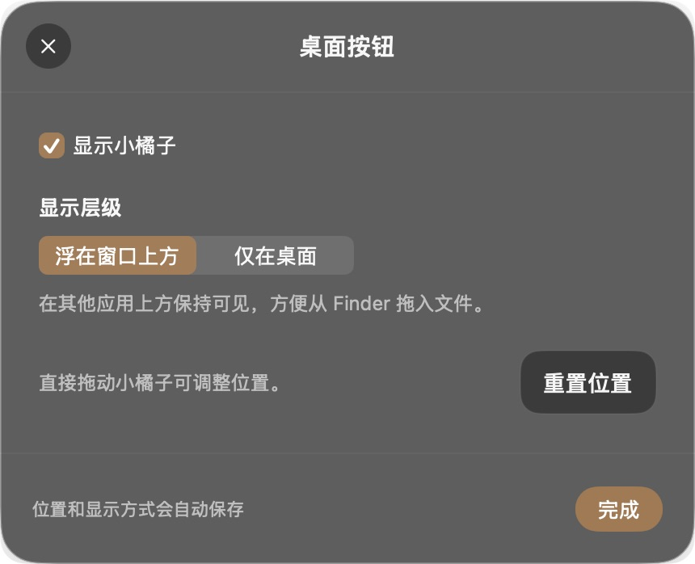
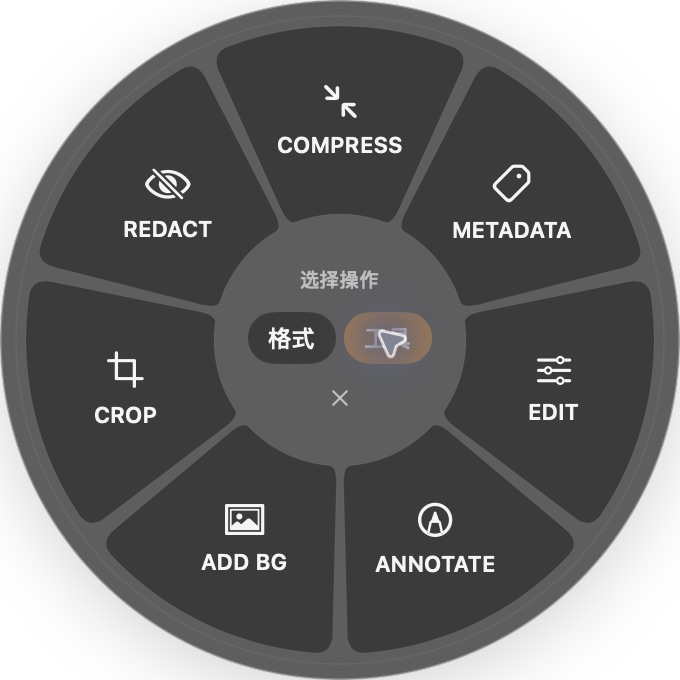
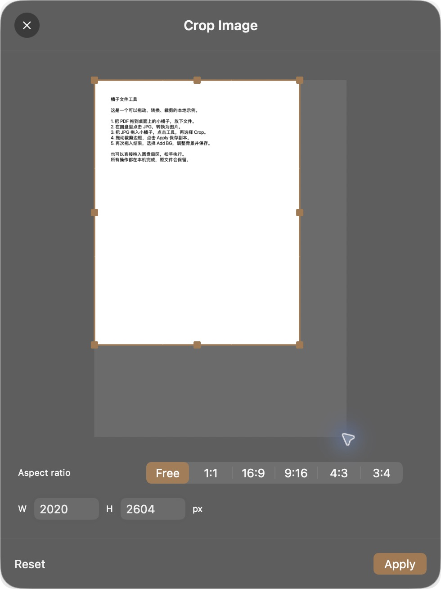
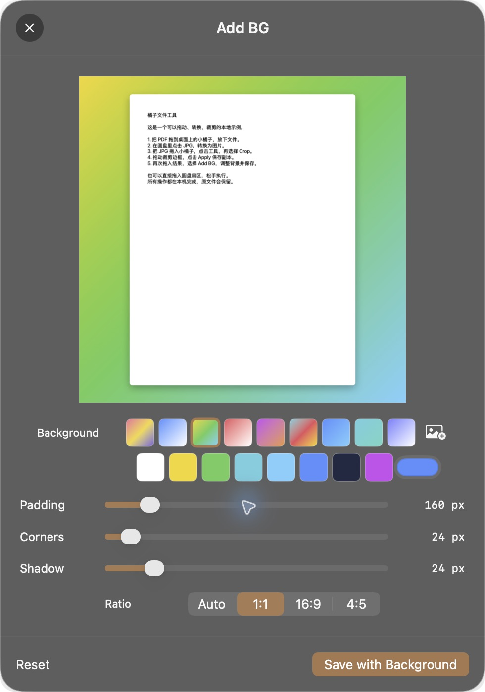

# 橘子 1.1.0：Mac 界面与桌面入口评审预览

日期：2026-10-04（Asia/Shanghai）。本轮只处理 Mac 体验；平台宣发素材等界面定稿后再讨论。

## 当前可确认的结果

新版已安装到“应用程序”。欢迎页、圆盘、桌面按钮设置和编辑器使用统一的原生玻璃材质、语义文字颜色和低饱和度橘棕色。三个欢迎页操作按钮均为 14 pt medium，包括“开始使用，收起窗口”。

新版已完成编译及安装验证；对最终安装的程序重新执行 **108 PASS / 0 FAIL / 0 SKIP**，并单独确认故意失败时保留失败回执、返回非零退出。108项由原有92项及新增16项组成。

**产品整体尚未验收完成。桌面小橘子作为主要入口的真实 Finder 拖放，以及按钮的真实鼠标移动，仍待实测确认。自动检查通过不能替代这两项。**

## 使用方式和设置

1. 在欢迎页点击“开始使用，收起窗口”，桌面小橘子继续显示。
2. 主要入口的设计是：拖入文件后在小橘子旁展开圆盘，放下文件后再点击操作；也可继续拖入格式扇区直接执行。该跨窗口手势的实际验收状态见下表。
3. 圆盘中心的“格式／工具”可以直接点击，无需保持Shift或Option。
4. 点击小橘子可选择文件。拖动小橘子的设计用于移动位置；右键可设置层级、重置位置或隐藏。
5. “桌面按钮设置”提供“浮在窗口上方／仅在桌面”，并自动保存。仅桌面模式的含义是其他应用窗口可以覆盖它。
6. 旧版Shift拖拽保留为可选兼容方式，默认关闭，不作为新版主要入口。

本轮未更新旧版演示视频或宣传图。现有发布资料和旧版92项报告保留为1.0.1历史记录，不作为1.1.0新界面的验收依据。

## 实际界面截图

全部截图只包含橘子窗口或演示文件名，未包含工作目录、私人文件名或完整桌面。

## 截图与交互审查

- 欢迎页：三项主操作都使用明确的按钮底板和相同字号；“开始使用”现在具备可识别的点击区域。说明从组合键改成拖入小橘子，并提供设置入口。
- 桌面按钮设置：显示开关、两种层级及自动保存说明集中在同一窗口。当前窗口层级回执支持设置已应用；真实窗口覆盖效果仍需实测。
- 圆盘：中心提供带文字的“格式／工具”选择，选中状态同时出现在辅助功能树中。圆盘扇区当前主要通过鼠标或方向键加回车操作，VoiceOver逐项选择扇区尚未验收。
- 裁剪和背景编辑：保持相同的玻璃材质、文字和低饱和度强调色；裁剪字段与实际输出使用同一取整规则。背景预设的输出颜色属于用户编辑功能，界面主题未改写这些颜色。
- 辅助功能边界：截图可检查字号、控件层次及裁切，但不能证明完整辅助功能符合性。VoiceOver、增强对比度、减少透明度和减少动态效果的真实体验仍待检查；本轮未修改系统外观偏好来模拟这些环境。

## 原生界面检查

| 项目 | 当前结果 | 依据及限制 |
| --- | --- | --- |
| 欢迎页的三个主操作按钮 | PASS | 原生截图；三个按钮共用14 pt medium字形和明确的圆角底板。 |
| 开始使用按钮收起欢迎窗口 | PASS | 真实点击后欢迎窗口关闭，桌面按钮继续显示。 |
| 桌面按钮可见、点击选择文件和右键菜单 | PASS | 实际按钮界面、文件选择器及右键设置菜单。 |
| 显示按钮、浮在窗口上方／仅在桌面设置 | PASS | 真实设置界面和原生日志中的可见性、窗口层级值。 |
| 退出再启动保留显示、层级选项 | PASS | 真实退出／重启后设置保持；已恢复显示且浮在窗口上方供评审。 |
| 演练窗口PDF拖入JPG扇区 | PASS | 真实NSDraggingSource/NSDraggingDestination拖放，生成2481×3508 JPG。 |
| 选择文件后点击格式／工具切换 | PASS | 原生文件选择和可点击模式按钮，未按修饰键，实际打开Crop编辑器。 |
| 真实拖动裁剪手柄并导出 | PASS | 界面2020×2604，重新读取实际JPEG头得到2020×2604。 |
| 裁剪结果拖入背景工具并保存 | PASS | 演练内真实拖放；背景预设3、1:1比例，导出2924×2924 JPEG。 |
| Finder拖文件到桌面小橘子，呼出并保留圆盘 | PENDING | 跨窗口自动拖放到达目标坐标但未收到目标拖入回调；尚不能区分工具输入限制与产品问题。已请求实际鼠标测试。 |
| 用鼠标拖动桌面小橘子并在重启后保持位置 | PENDING | 位置保存与屏幕边界自动用例通过；实际鼠标移动尚未验收。 |
| 仅桌面模式下被其他应用窗口覆盖 | PENDING | 设置与窗口层级已验证；真实覆盖关系未完成视觉验收。 |
| 真实多显示器、Spaces和全屏应用拖入 | NOT_TESTED | 几何边界自动检查不能代替真实显示器和桌面切换。 |
| macOS14/15、Intel、浅色系统外观 | NOT_TESTED | 本轮实际环境为Apple Silicon、macOS26.5.1。旧系统玻璃回退和外观自适应已编码，但未在这些环境运行。 |

本轮实际操作链路：`Demo Guide.pdf → Demo Guide.jpg → Demo Guide Cropped.jpg → Demo Guide Cropped BG.jpg`。转换图片2481×3508；裁剪界面与实际输出均为2020×2604；背景1:1实际输出2924×2924。输出尺寸读取实际文件，未使用宣传画面作为结果证明。

## 全部108项自动用例

以下为最终安装版本的逐项结果。“断言”说明自动用例的具体范围；几何、设置和状态模型检查不证明真实跨窗口拖放、真实多屏或全部功能矩阵。原有92项覆盖范围沿用此前已披露的限制。

| ID | 用例 | 源码标识 | 断言 | 当前实测 | 结果 |
| --- | --- | --- | --- | --- | --- |
| MAC-001 | PNG 转 JPG | convert_jpg | 有效文件，可解码，尺寸 240×320，非空；文件类型必须与目标编码一致 | public.jpeg, 240×320, 2815 bytes | PASS |
| MAC-002 | PNG 转 PNG | convert_png | 有效文件，可解码，尺寸 240×320，非空；文件类型必须与目标编码一致 | public.png, 240×320, 2422 bytes | PASS |
| MAC-003 | PNG 转 WEBP | convert_webp | 有效文件，可解码，尺寸 240×320，非空；文件类型必须与目标编码一致 | org.webmproject.webp, 240×320, 298 bytes | PASS |
| MAC-004 | PNG 转 HEIC | convert_heic | 有效文件，可解码，尺寸 240×320，非空；文件类型必须与目标编码一致 | public.heic, 240×320, 602 bytes | PASS |
| MAC-005 | PNG 转 TIFF | convert_tiff | 有效文件，可解码，尺寸 240×320，非空；文件类型必须与目标编码一致 | public.tiff, 240×320, 310590 bytes | PASS |
| MAC-006 | PNG 转 AVIF | convert_avif | 有效文件，可解码，尺寸 240×320，非空；文件类型必须与目标编码一致 | public.avif, 240×320, 490 bytes | PASS |
| MAC-007 | PNG 转 BMP | convert_bmp | 有效文件，可解码，尺寸 240×320，非空；文件类型必须与目标编码一致 | com.microsoft.bmp, 240×320, 307338 bytes | PASS |
| MAC-008 | PNG 转 PDF | convert_pdf | 以 %PDF 开头，PDFKit 读取为 1 页 | 源码断言通过 | PASS |
| MAC-009 | PNG 转 DOCX | convert_docx | ZIP 内包含 word/document.xml 和 word/media/image0.png | 源码断言通过 | PASS |
| MAC-010 | 转换后原文件保留 | source_unchanged | 前后文件字节完全相同 | 源码断言通过 | PASS |
| MAC-011 | 同名输出保护 | collision_avoids_overwrite | 两个输出路径不同，不覆盖已存在结果 | 源码断言通过 | PASS |
| MAC-012 | 按原图尺寸裁剪 | crop_full_resolution | 保存后重新解码为 144×160 | 源码断言通过 | PASS |
| MAC-013 | 背景边距 | background_padding | 输出画布为 224×240 | 源码断言通过 | PASS |
| MAC-014 | 16:9 背景比例 | background_aspect_ratio | 输出宽高比与 16:9 的差小于 0.01 | 源码断言通过 | PASS |
| MAC-015 | 预览与导出比例一致 | preview_matches_export_ratio | 预览和导出宽高比之差小于 0.02 | 源码断言通过 | PASS |
| MAC-016 | 遮盖写入像素 | redaction_is_baked_into_pixels | 取样 RGB 三通道均小于 5 | [0, 0, 0, 255] | PASS |
| MAC-017 | 旋转尺寸 | rotate_dimensions | 输出尺寸变为 320×240 | 源码断言通过 | PASS |
| MAC-018 | 饱和度归零 | edit_saturation | RGB 相邻通道之差均小于 3 | 源码断言通过 | PASS |
| MAC-019 | 多页 PDF 全部导出 | pdf_all_pages | 返回两张图片 | 源码断言通过 | PASS |
| MAC-020 | PDF 以 300 DPI 栅格化 | pdf_300dpi | 导出图片为 300×400 像素 | 源码断言通过 | PASS |
| MAC-021 | 拆分再合并 | pdf_split_merge | 拆分为两个文件，合并结果为两页 | 源码断言通过 | PASS |
| MAC-022 | 第 1 个扇区命中 | radial_sector_0 | 命中索引 0；此项为坐标计算检查 | 源码断言通过 | PASS |
| MAC-023 | 第 2 个扇区命中 | radial_sector_1 | 命中索引 1；此项为坐标计算检查 | 源码断言通过 | PASS |
| MAC-024 | 第 3 个扇区命中 | radial_sector_2 | 命中索引 2；此项为坐标计算检查 | 源码断言通过 | PASS |
| MAC-025 | 第 4 个扇区命中 | radial_sector_3 | 命中索引 3；此项为坐标计算检查 | 源码断言通过 | PASS |
| MAC-026 | 第 5 个扇区命中 | radial_sector_4 | 命中索引 4；此项为坐标计算检查 | 源码断言通过 | PASS |
| MAC-027 | 第 6 个扇区命中 | radial_sector_5 | 命中索引 5；此项为坐标计算检查 | 源码断言通过 | PASS |
| MAC-028 | 第 7 个扇区命中 | radial_sector_6 | 命中索引 6；此项为坐标计算检查 | 源码断言通过 | PASS |
| MAC-029 | 第 8 个扇区命中 | radial_sector_7 | 命中索引 7；此项为坐标计算检查 | 源码断言通过 | PASS |
| MAC-030 | 圆盘中心不执行 | radial_center_cancels | 不选中任何扇区 | 源码断言通过 | PASS |
| MAC-031 | 圆盘外部不执行 | radial_outside_cancels | 不选中任何扇区 | 源码断言通过 | PASS |
| MAC-032 | 屏幕边缘定位 | radial_screen_edge_clamp | 整个菜单框位于测试屏幕内；未测试真实多屏 | 源码断言通过 | PASS |
| MAC-033 | 隐藏当前格式 | current_format_excluded | 目录不包含 PNG | 源码断言通过 | PASS |
| MAC-034 | 七个图片工具 | image_tool_catalog | 工具数量为 7；此断言未逐个执行工具界面 | 源码断言通过 | PASS |
| MAC-035 | SRT／VTT 时间与文字 | subtitle_conversion | VTT 以 WEBVTT 开头，时间变为 00:00:01.500，纯文本含“你好” | 源码断言通过 | PASS |
| MAC-036 | 移除位置信息 | metadata_location_removed | 导出 JPEG 回读不含 GPS 字典 | 源码断言通过 | PASS |
| MAC-037 | 作者写入后回读 | metadata_author_saved | 导出 JPEG 的 IPTC Byline 回读为 Kris | 源码断言通过 | PASS |
| MAC-038 | 描述写入后回读 | metadata_caption_saved | IPTC CaptionAbstract 回读为 Local test | 源码断言通过 | PASS |
| MAC-039 | 元数据编辑保留原图 | metadata_original_preserved | 原文件字节完全相同 | 源码断言通过 | PASS |
| MAC-040 | 压缩后体积减小 | compression_smaller | 结果字节数小于原文件；此项同时使用缩小尺寸 | 源码断言通过 | PASS |
| MAC-041 | 压缩时最长边限制 | compression_resize | 重新解码后最长边等于 128 | 源码断言通过 | PASS |
| MAC-042 | 批量部分失败保留成功项 | partial_batch_keeps_successes | 返回 1 个成功结果、1 个错误，成功文件仍存在 | 源码断言通过 | PASS |
| MAC-043 | 长文本分页 | text_pagination | 生成页面数量大于 1；未逐页核对末尾全文 | 源码断言通过 | PASS |
| MAC-044 | ZIP 解压与内容回读 | archive_extract | 解压后的 note.txt 内容完全一致 | 源码断言通过 | PASS |
| MAC-045 | ZIP 转 TAR | archive_convert | 系统 tar 列表中包含 note.txt | 源码断言通过 | PASS |
| MAC-046 | WAV 转 MP3 | audio_real_encode | 生成 MP3，文件大于 100 字节；此原断言未做完整播放检查 | 源码断言通过 | PASS |
| MAC-047 | MP4 转 WebM | video_real_encode | 生成 WebM，文件大于 100 字节；此原断言未做全帧解码检查 | 源码断言通过 | PASS |
| MAC-048 | 视频移除音轨 | video_mute_removes_audio | ffprobe 查询音频流为空 | 源码断言通过 | PASS |
| MAC-049 | 视频裁切时间 | media_trim_duration | ffprobe 时长与 1 秒之差小于 0.1 秒 | 源码断言通过 | PASS |
| MAC-050 | 忽略上次拖拽留下的文件 | drag_stale_pasteboard_ignored | Old file drag + held mouse does not activate. | Old file drag + held mouse does not activate. | PASS |
| MAC-051 | 缺少拖动通知时仍能识别新会话 | drag_fresh_pasteboard_without_event | Fresh file drag activates without an NSEvent callback; physical Shift remains a separate manual check. | Fresh file drag activates without an NSEvent callback; physical Shift remains a separate manual check. | PASS |
| MAC-052 | 编辑器内部拖动不触发全局菜单 | drag_editor_mouse_ignored | Crop, paint and window drags stay outside the desktop entry. | Crop, paint and window drags stay outside the desktop entry. | PASS |
| MAC-053 | 取消或完成后本次会话保持关闭 | drag_consumed_session_stays_closed | Esc/drop consumes the session until button release. | Esc/drop consumes the session until button release. | PASS |
| MAC-054 | 松手后下一次新拖拽可以再次激活 | drag_next_session_rearms | Release resets the baseline; a new file drag re-arms. | Release resets the baseline; a new file drag re-arms. | PASS |
| MAC-055 | 读取标准文件 URL 拖拽数据 | drag_modern_file_url_read | Private pasteboard with public.file-url. | Private pasteboard with public.file-url. | PASS |
| MAC-056 | 读取旧文件路径格式、去重并过滤 | drag_legacy_file_paths_read | NSFilenamesPboardType works, duplicates and unsupported extensions are filtered. | NSFilenamesPboardType works, duplicates and unsupported extensions are filtered. | PASS |
| MAC-057 | PNG 透明像素与半透明红色保存后读回 | transparency_png | Corner [0, 0, 0, 0]; half-transparent red center [128, 19, 0, 128], premultiplied RGBA. | Corner [0, 0, 0, 0]; half-transparent red center [128, 19, 0, 128], premultiplied RGBA. | PASS |
| MAC-058 | WEBP 透明像素与半透明红色保存后读回 | transparency_webp | Corner [0, 0, 0, 0]; half-transparent red center [128, 19, 0, 128], premultiplied RGBA. | Corner [0, 0, 0, 0]; half-transparent red center [128, 19, 0, 128], premultiplied RGBA. | PASS |
| MAC-059 | 透明图片转 JPG 后透明区填白 | jpeg_transparency_white | Transparent corner becomes white: [255, 255, 255, 255]. | Transparent corner becomes white: [255, 255, 255, 255]. | PASS |
| MAC-060 | 按照片方向标记旋转像素 | exif_orientation_applied | EXIF orientation 6 loads as 320×240. | EXIF orientation 6 loads as 320×240. | PASS |
| MAC-061 | 导出后不重复旋转 | exif_orientation_not_applied_twice | Export has normalized pixels and no stale orientation tag. | Export has normalized pixels and no stale orientation tag. | PASS |
| MAC-062 | 拒绝损坏图片 | corrupt_image_rejected | Malformed PNG is rejected. | Malformed PNG is rejected. | PASS |
| MAC-063 | 超出宽度上限时先拒绝分配 | oversized_canvas_rejected | Width above 24000 is rejected before allocation. | Width above 24000 is rejected before allocation. | PASS |
| MAC-064 | 拒绝完全位于图像外的裁剪框 | outside_crop_rejected | Crop completely outside the image is rejected. | Crop completely outside the image is rejected. | PASS |
| MAC-065 | 只移除定位时保留作者 | gps_only_removal_keeps_author | Removing only location preserves the existing author. | Removing only location preserves the existing author. | PASS |
| MAC-066 | 关闭移除定位时保留定位 | gps_preserved_when_requested | Location remains only when removal is disabled. | Location remains only when removal is disabled. | PASS |
| MAC-067 | 中文作者与描述写入 PNG 后读回 | png_unicode_metadata | PNG author and description survive Unicode round-trip. | PNG author and description survive Unicode round-trip. | PASS |
| MAC-068 | 不缩尺寸的 JPG 压缩 | jpeg_compression_preserves_dimensions | JPEG compression without resizing remains 256×256 and shrinks bytes. | JPEG compression without resizing remains 256×256 and shrinks bytes. | PASS |
| MAC-069 | 不缩尺寸的 PNG 减色压缩 | png_compression_shrinks | PNG uses lossy color quantization; size stays 256×256. | PNG uses lossy color quantization; size stays 256×256. | PASS |
| MAC-070 | PDF 压缩保留页数和物理页面尺寸 | pdf_compression_page_geometry | Raster compression shrinks bytes and preserves page dimensions within 1 pt; searchable text is not retained. | Raster compression shrinks bytes and preserves page dimensions within 1 pt; searchable text is not retained. | PASS |
| MAC-071 | 批量全部失败时明确列出错误 | batch_all_failures_reported | Two missing inputs produce zero successes and two explicit errors. | Two missing inputs produce zero successes and two explicit errors. | PASS |
| MAC-072 | 自定义纯色背景写入最终图片 | background_custom_color | Custom green background corner: [0, 255, 0, 255]. | Custom green background corner: [0, 255, 0, 255]. | PASS |
| MAC-073 | 圆角区域露出背景 | background_rounded_corner | Rounded image corner reveals the background: [0, 255, 0, 255]. | Rounded image corner reveals the background: [0, 255, 0, 255]. | PASS |
| MAC-074 | 照片背景写入最终图片 | background_photo_rendered | Photo background is composited into the exported pixels. | Photo background is composited into the exported pixels. | PASS |
| MAC-075 | 画笔标注烘焙进导出像素 | annotation_pen_export | Decoded export has 5318 changed color bytes, with actual raster annotation. | Decoded export has 5318 changed color bytes, with actual raster annotation. | PASS |
| MAC-076 | 矩形标注烘焙进导出像素 | annotation_rectangle_export | Decoded export has 12816 changed color bytes, with actual raster annotation. | Decoded export has 12816 changed color bytes, with actual raster annotation. | PASS |
| MAC-077 | 箭头标注烘焙进导出像素 | annotation_arrow_export | Decoded export has 8062 changed color bytes, with actual raster annotation. | Decoded export has 8062 changed color bytes, with actual raster annotation. | PASS |
| MAC-078 | 文字标注烘焙进导出像素 | annotation_text_export | Decoded export has 6522 changed color bytes, with actual raster annotation. | Decoded export has 6522 changed color bytes, with actual raster annotation. | PASS |
| MAC-079 | 先黑块遮挡再模糊不露出原内容 | redaction_then_blur_stays_hidden | Later blur uses the already redacted pixels; center [0, 0, 0, 255]. | Later blur uses the already redacted pixels; center [0, 0, 0, 255]. | PASS |
| MAC-080 | 先黑块遮挡再像素化不露出原内容 | redaction_then_pixelate_stays_hidden | Later pixelate uses the already redacted pixels; center [0, 0, 0, 255]. | Later pixelate uses the already redacted pixels; center [0, 0, 0, 255]. | PASS |
| MAC-081 | 裁剪比例影响真实输出尺寸 | crop_ratio_model | Selecting 1:1 produces 240×240 from 240×320. | Selecting 1:1 produces 240×240 from 240×320. | PASS |
| MAC-082 | 裁剪像素输入影响真实输出尺寸 | crop_pixel_dimensions | Pixel fields drive actual 120×90 output. | Pixel fields drive actual 120×90 output. | PASS |
| MAC-083 | 重置恢复原始裁剪状态和像素字段 | editor_reset_restores_original | Reset restores crop, pixel fields and annotation state. | Reset restores crop, pixel fields and annotation state. | PASS |
| MAC-084 | Option 状态切换到七个图片工具 | option_switches_seven_tools | Option changes the JPEG menu to seven tools. | Option changes the JPEG menu to seven tools. | PASS |
| MAC-085 | 释放 Option 状态切换回八个图片格式 | option_release_restores_formats | Releasing Option restores eight JPEG format targets. | Releasing Option restores eight JPEG format targets. | PASS |
| MAC-086 | 混合文件只展示共有操作 | mixed_batch_common_actions | PNG + PDF exposes only their common conversions and tools; format order follows the first file. | PNG + PDF exposes only their common conversions and tools; format order follows the first file. | PASS |
| MAC-087 | DOCX 四个关键 XML 部分均可解析 | docx_xml_parts_parse | Content types, package relationships, document and image relationships all parse as XML. | Content types, package relationships, document and image relationships all parse as XML. | PASS |
| MAC-088 | DOCX 内嵌图片可解码且尺寸正确 | docx_embedded_image_decodes | DOCX contains a real, decodable 240×320 image. Office rendering remains manual. | DOCX contains a real, decodable 240×320 image. Office rendering remains manual. | PASS |
| MAC-089 | 末页文字经 OCR 证明没有被截断 | text_last_page_contains_tail | OCR of the last rendered page confirms the ending text was not truncated. | OCR of the last rendered page confirms the ending text was not truncated. | PASS |
| MAC-090 | 解压前拒绝包含符号链接的归档 | archive_symlink_rejected | ZIP containing a symbolic link is rejected before extraction. | ZIP containing a symbolic link is rejected before extraction. | PASS |
| MAC-091 | MP3 编码正确且全文件可解码 | audio_stream_fully_decodes | Expected mp3 codec and complete FFmpeg decode without errors. | Expected mp3 codec and complete FFmpeg decode without errors. | PASS |
| MAC-092 | WebM 编码正确且全文件可解码 | video_stream_fully_decodes | Expected vp9 codec and complete FFmpeg decode without errors. | Expected vp9 codec and complete FFmpeg decode without errors. | PASS |
| MAC-093 | 桌面按钮的初始设置 | desktop_preferences_defaults | 新安装默认显示桌面按钮，并浮在窗口上方。 | Fresh installation shows a floating button. | PASS |
| MAC-094 | 桌面按钮设置持久化 | desktop_preferences_restart | 显示开关、桌面层级及位置从已保存设置重建后保持一致。 | Visibility, layer and position survive reconstruction from saved defaults. | PASS |
| MAC-095 | 重置位置保留其他设置 | desktop_reset_preserves_preferences | 重置清除位置，但保留显示开关和层级。 | Resetting the position preserves chosen visibility and layer. | PASS |
| MAC-096 | 左侧副显示器位置恢复 | desktop_negative_screen_restore | 负坐标显示器上的按钮保持原有有效位置。 | A button on a display left of the main display keeps its position. | PASS |
| MAC-097 | 移除显示器后的定位 | desktop_disconnected_screen_recovery | 按钮完整返回剩余屏幕可见范围。 | A removed display cannot strand the button off screen. | PASS |
| MAC-098 | 异常位置恢复 | desktop_invalid_saved_position | 非有限坐标返回默认位置。 | Non-finite stored coordinates fall back to the default position. | PASS |
| MAC-099 | 移动的屏幕边界限制 | desktop_drag_bounds | 68 pt按钮完整留在屏幕可见范围内。 | Dragging past screen edges keeps the complete 68 pt button within the visible frame. | PASS |
| MAC-100 | 圆盘避让小橘子 | desktop_wheel_keeps_drop_target_clear | 四角定位时圆盘完整可见，且不覆盖原拖放入口。 | At all four corners the wheel stays on screen without covering the original drop target. | PASS |
| MAC-101 | 点击工具后无需持续按键 | desktop_tools_without_modifiers | 移动到工具扇区时，显式选择的工具模式保持有效。 | A visible mode selection remains active as the pointer enters a tool sector. | PASS |
| MAC-102 | 格式模式不受Option意外切换 | desktop_formats_ignore_modifiers | 新入口选择格式后，Option不覆盖显式选择。 | Option does not unexpectedly override the explicit format selection at the new entry. | PASS |
| MAC-103 | 中心暂存的入口边界 | desktop_center_staging_is_scoped | 仅桌面按钮流程允许中心暂存，且不推断转换操作。 | Only the desktop button flow permits staging in the center; no conversion action is inferred there. | PASS |
| MAC-104 | 文件选择入口的模式保持 | picker_visible_mode_persists | 工具切换后进入扇区无需按Option，仍选择压缩工具。 | File-picker mode switching works without holding Option. | PASS |
| MAC-105 | 批量文件的共同格式 | desktop_mixed_batch_common_formats | PNG/PDF批次仅显示共同可用的JPG和DOCX。 | A PNG/PDF batch exposes only formats available to both. | PASS |
| MAC-106 | 裁剪字段与导出取整一致 | crop_fractional_fields_match_export | 小数位置的裁剪字段和实际导出都为143×160，无多出1像素。 | Fractional handle positions report and export the same integer dimensions, without an extra pixel. | PASS |
| MAC-107 | 小数位置的精确尺寸输入 | crop_typed_size_at_fractional_origin | 输入120×90后，界面和导出仍精确为120×90。 | Exact typed dimensions stay exact even with a fractional crop origin. | PASS |
| MAC-108 | 拒绝无效裁剪坐标 | crop_nonfinite_coordinates_rejected | 非有限坐标在送入图形处理前被拒绝。 | Invalid coordinates are rejected before Core Graphics receives them. | PASS |

## 版本与证据

- 最终安装版本：1.1.0，build 3，本地预览；Apple Silicon，macOS26.5.1。
- 安装程序SHA-256：`0ed3b947b69168afc9b039995ed9748facb5bf4dac786a1841185eafdaff9f34`。
- 该安装程序与本轮生成的应用包二进制一致，临时签名校验通过。尚未增加Developer ID签名或公证。
- 检查完成时间（UTC）：2026-10-03T17:35:34.997997+00:00。
- [全部自动检查回执](evidence/ui-1.1.0/installed-verification.json)
- [安装版本汇总](evidence/ui-1.1.0/installed-summary.json)
- [故意失败回执](evidence/ui-1.1.0/failure-receipt-probe.json)（预期1 FAIL，独立探针；不是实际功能失败）
- [原生界面事件](evidence/ui-1.1.0/native-ui-events.json)（仅导出演示文件名，已移除绝对文件路径）
- [界面验收状态及截图校验值](evidence/ui-1.1.0/ui-review.json)
- [对应源码校验值](evidence/ui-1.1.0/source-sha256.json)
- [1.0.1旧版92项报告](TESTING.md)

## 定稿前待确认

- 真实Finder拖放：将演示PDF用鼠标拖到桌面小橘子，观察是否展开圆盘，放下后是否保留圆盘，再点击JPG检查输出。当前自动工具跨窗口未收到目标拖入事件，因此待确认工具限制或产品问题。
- 真实按钮移动：拖动小橘子到新位置，退出再启动，确认位置保持。
- 仅桌面模式：选择后确认回到桌面可见，其他应用窗口覆盖时不挡住工作。
- Kris确认整体视觉和交互后，再修订中英GitHub教程及社交媒体演示方案。

本轮修改仅保存在本地评审分支；未公开仓库或发布社交媒体内容。
